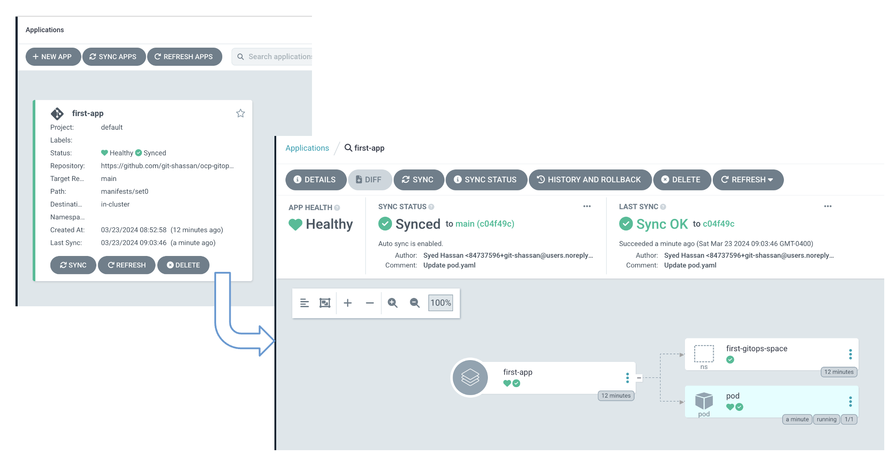

# OpenShift GitOps Lab

## Install GitOps Operator

### Find out the channel to be used: 
```
oc get packagemanifests.packages.operators.coreos.com -n openshift-marketplace openshift-gitops-operator -o jsonpath='{.status.defaultChannel}{"\n"}'
```
The outout should show one or more values, like: 
> [lab-user@bastion ~]$ oc get packagemanifests.packages.operators.coreos.com -n openshift-marketplace openshift-gitops-operator -o jsonpath='{.status.defaultChannel}{"\n"}'<br>
> **latest**<br>
> [lab-user@bastion ~]$ <br>

### Create the subscriptions: 
Using this channel value, create the subscription manifest for Installing the OpenShift GitOps Operator as shown below. Instead of creating a new namespace and operatorgroup, the default created namespace called "openshift-operators" can be used as the GitOps operator supports AllNamespace as targets: 

```
cat << EOF | oc apply -f -
apiVersion: operators.coreos.com/v1alpha1
kind: Subscription
metadata:
  name: openshift-gitops-operator
  namespace: openshift-operators
spec:
  chanenel: latest
  installPlanApproval: Automatic
  name: openshift-gitops-operator
  source: redhat-operators
  sourceNamespace: openshift-marketplace
EOF
```
### Authorizing GitOps ServiceAccount:  
Upon installation, OpenShift GitOps Operator creates namespace `openshift-gitops` and a service account called `openshift-gitops-argocd-application-controller` in that namespace. This serviceaccount is used to apply the manifests on the cluster. While this account has sufficient privilages in that `openshift-gitops` namespace, it doesn't have privilages in other namespaces. 

Since we want to create various resources with the objective of understanding the GitOps applications and how they work, we can go ahead and give this service account a cluster-admin level priviage.

> **NOTE** in a production environment, you may need to be more restrictive about the role that you bind to this service account and the namespaces you give it access to.

User the following command to give this service account cluster wide admin role: 

```
oc create clusterrolebinding gitops-scc-binding --clusterrole cluster-admin  --serviceaccount openshift-gitops:openshift-gitops-argocd-application-controller
```

### Verify if Operator is correctly installed: 

Following two commands can be used to ensure that the operator installation has been accepted and has been successful: 
```
[lab-user@bastion ~]$ oc get operators openshift-gitops-operator.openshift-operators 
NAME                                            AGE
openshift-gitops-operator.openshift-operators   2m40s
[lab-user@bastion ~]$ oc get csv -n openshift-operators | grep gitops
openshift-gitops-operator.v1.12.0   Red Hat OpenShift GitOps   1.12.0    openshift-gitops-operator.v1.11.2   **Succeeded**
[lab-user@bastion ~]$
```
Additionally, to verify if the deployment for the operator is healthy, use the following: 
```
oc get deployment -n openshift-gitops
```
output should show all deployments are running successfully, as shown here: 
```
oc get deployment -n openshift-gitops
NAME                                         READY   UP-TO-DATE   AVAILABLE   AGE
cluster                                      1/1     1            1           8m10s
kam                                          1/1     1            1           8m10s
openshift-gitops-applicationset-controller   1/1     1            1           8m7s
openshift-gitops-dex-server                  1/1     1            1           8m10s
openshift-gitops-redis                       1/1     1            1           8m8s
openshift-gitops-repo-server                 1/1     1            1           8m8s
openshift-gitops-server                      1/1     1            1           8m7s
```

## Accessing the GitOps Operator's GUI:
To access the GUI, you will need a URL and credentials. These can be retrieved using the followings: 

### Get Routes:
To find the URL to access, use the following command: 
```
oc get -n openshift-gitops routes openshift-gitops-server -o jsonpath='{.status.ingress[].host}{"\n"}'
```
Output will be similar to: 
> openshift-gitops-server-openshift-gitops.apps.cluster-jl57k.dynamic.redhatworkshops.io

### Get Secret: 
The default user name is `admin`, and the password for that admin user can be retrieved using the following:
```
oc get -n openshift-gitops secrets openshift-gitops-cluster -o jsonpath='{.data.admin\.password}' | base64 -d ; echo
```
output will be similar to:
> DVqetLgGo30UCNb1pm4X8JnAPQShRyEx

### ArgoCD GUI: 

Access ArgoCD GUI using the information above. The GUI might look like the following: 


## GitOps - the very first time:
The GitOps Operator defines a CR caleld "Applications". Applications are used to sync the running cluster with the manifests defined on Git. The following figure describes the fields in the Application CR definition: 


> **TIP** OpenShift GitOps Operator is the productized version of "ArgoCD". Hence the terms are used interchangibly

### Your first application: 
Lets create a simple application that will create a namespace and run a pod in that namespace. The manifests for these have already been defined [here](https://github.com/git-shassan/ocp-gitops/tree/main/manifests/set0). All the application has to do is point to the repository and let GitOps do its magic. Create the applicaiton as shown here:

```
cat << EOF | oc apply -f -
apiVersion: argoproj.io/v1alpha1
kind: Application
metadata:
  annotations:
  name: first-app
  namespace: openshift-gitops
spec:
  destination:
    server: 'https://kubernetes.default.svc'
  project: default
  source:
    directory:
      recurse: true
    path: manifests/set0
    repoURL: https://github.com/git-shassan/ocp-gitops.git
    targetRevision: main
  syncPolicy:
    automated:
      prune: true
      selfHeal: true
    retry:
      limit: 20
EOF
```

### Verifying Application's status using OC command:
Once the application is created, you can view its staus progress as seen here:

```
oc get apps -n openshift-gitops first-app 
NAME        SYNC STATUS   HEALTH STATUS
first-app   Synced        Progressing
## pause a few seconds
oc get apps -n openshift-gitops first-app 
NAME        SYNC STATUS   HEALTH STATUS
first-app   Synced        Healthy
```
The application's `Healthy` status indicates that the namesapce and pod has been created successfully. Confirm this as shown here:

```
oc get pods -n first-gitops-space
NAME   READY   STATUS    RESTARTS   AGE
pod    1/1     Running   0          4m15s
```
You can try deleting this pod, but since since Git is the source of truth, and the pod definition still exists on Git, the pod will get recreated as shown here: 

```
[lab-user@bastion ~]$ oc delete pods -n first-gitops-space pod 
pod "pod" deleted
[lab-user@bastion ~]$ oc get pods -n first-gitops-space
NAME   READY   STATUS    RESTARTS   AGE
pod    1/1     Running   0          3s
[lab-user@bastion ~]$
```

### Verifying Application status using GUI:
The application's status and the CRs it created can be easily verified on the GUI as shown here: 



## Order of applying CRs -  ArgoCD SyncWaves:
The previous example was simple and easy. However, even in this simple set of CRs, there has to be an sequence for successfully applying them. If the GitOps tries to create the Pod before creating the namespace, then it would fail. 
The GitOps Operator is aware that certain things go in certain order, and takes care of that for you. However, in many cases (like in case of Custom defined resources) it wont be able to make that decision. In those cases, you can provide it guidance by assosiating a number with the manifest. This number, called "SyncWave" helps the operator determine the sequence for applying the various manifests it sees on Git. 

Additionally, the operator can categorize the manifests in three `Phases`: PreSync, Sync, and PostSync. By default, everything is in the `Sync` category. Manifests in each category are individually sorted based on their SyncWave (defaylt SyncWave value is 0) 

Combining these sorting mechanisms, the GitOps operator uses the following order to determine the order in which the manifest should be applied:
* The Phase that they’re in, i.e. "Pre-Sync", "Sync", or "Post-Sync". Manifests in one has have to be successfully applied before the operator moves to the next Phase.
* The "Syncwave" value defined in the resource's annotation, starting from the lowest value to the highest
* If both of the above matcgm between two manifests, then the tie breaker is the CR or `kind` value.  Namespaces first, then services, then deployments, etc …​ (this is what enabled our first application to work without providing any sorting guidance) 
* The final tie breaker, if all else matches, is the name of the manifest in ascending order 
ascending order

### More about Sync Phases: 

The Phase is defined a Manifest under .metadata.annotations. argocd.argoproj.io/hookFor Example: 
```
metadata: 
  annotations: 
    argocd.argoproj.io/hook: PreSync
```
The purpose of the phase types is: 
* PreSync:  Is prioritized to be applied before resources in "Sync" phase are 	applied
 * Sync:  Resources in this phase are allied after all applications in "PreSync" 	phases have been successfully applied and reached Healthy state
* PostSync: Resources in this phase will run after successful "sync"  (e.g. 	email notifications)


(sourced from this [site](https://redhat-scholars.github.io/argocd-tutorial/argocd-tutorial/04-syncwaves-hooks.html))

A SyncFail phase is also defined, and the resources are applied if Sync fails

### More about SyncWaves: 

All manifests have a wave of zero by default. Wave value can be set using metadata.annotations.argocd.argoproj.io/sync-wave. The wave can also be negative as well. For example: metadata:
```
    annotations:
      argocd.argoproj.io/sync-wave: "-203"
```

the GitOps Operator (ArgoCD) will apply the lowest value, and make sure it returns a "healthy" status before moving on.
Argo CD won’t apply the next manifest until the previous reports "healthy" 

(sourced from this [site](https://redhat-scholars.github.io/argocd-tutorial/argocd-tutorial/04-syncwaves-hooks.html))

## Create Application to demonstrate SyncWaves:

To create an application demonstrating Sync Waves, use the following:
```
mkdir ~/gitops
cd ~/gitops
cat << EOF > app1.yaml
apiVersion: argoproj.io/v1alpha1
kind: Application
metadata:
  annotations:
  labels:
    app.kubernetes.io/instance: ebc-multicloud-gitops-hub
  name: experiment-app1
  namespace: openshift-gitops
spec:
  destination:
    server: 'https://kubernetes.default.svc'
  project: default
  source:
    directory:
      recurse: true
    path: manifests/set1
    repoURL: https://github.com/git-shassan/ocp-gitops.git
    targetRevision: main
  syncPolicy:
    automated:
      prune: true
      selfHeal: true
    retry:
      limit: 20
EOF
```

## Run the application demonstrating SyncWaves:

This application will demonstrate the use of SyncWaves. The applications being called are defined with the following Sync Wave values: 

| manifest | kind | name | namespace | Phase | SyncWave | Notes |
| ------------- | ------------- |------------- | ------------- |------------- |------------- |------------- |
| ns1.yaml  | Namespace | argotest1-1 | | Sync | 200 | |
| sa1.yaml  | ServiceAccount | cli-job-sa | argotest1-1 | Sync | 201 | |
| role1.yaml  | ClusterRoleBinding | cli-job-sa-argotest1-1-rolebinding || Sync | 202 | |
| job1.yaml | Job | testjob-1-1 | argotest1-1 |Sync | 203 | This job will take 100 seconds to finish | 
| powerpod2.yaml | Namespace | argotest1-2 || Sync | 300 | This resource will have to wait for "tesetjob-1-1" to complete"
| powerpod2.yaml | ServiceAccount | cli-job-sa | argotest1-2 | Sync | 300 | |
| powerpod2.yaml | ClusterRoleBinding | cli-job-sa-argotest1-2-rolebinding | argotest1-2 | Sync | 302 | |
| powerpod2.yaml | Job | testjob1-2 | argotest1-2 | Sync | 303 | |


Run the application using following command: 
```
oc apply -f app1.yaml 
```
Now observe that the application shows up on ArgoCD's GUI: 


The image shows that the application hasn't synced yet. That is because all the resources haven't been successfully applied. This is because "testjob1-1" is still running and hasn't reached a "Healthy" Status (its stutus will show as "Progressing")

Take a look at testjob1-1's logs, and it will show that the counter is still running: 


Once the counter reaches 10, the job will complete, and now the next resource will be applied. The next resource happens to be creation of Namespace called "argotest1-2", based on SyncWave values as seen in the above table. Then the subsequenet one will be applied, and so on. 

Eventually, the application reaches a full sync status once all resources have reaached a Healthy status: 


As a final step, check the status of applications using CLI:
```
oc get applications.argoproj.io -n openshift-gitops experiment-app1
```
Output will show the new application: 

> NAME&nbsp;&nbsp;&nbsp;&nbsp;&nbsp;&nbsp;&nbsp;&nbsp;&nbsp;&nbsp;&nbsp;&nbsp;&nbsp;&nbsp;&nbsp;&nbsp;&nbsp;&nbsp;&nbsp;&nbsp;&nbsp;&nbsp;&nbsp;SYNC&nbsp;STATUS&nbsp;&nbsp;&nbsp;HEALTH&nbsp;STATUS<br>
> experiment-app1&nbsp;&nbsp;&nbsp;&nbsp;&nbsp;&nbsp;Synced&nbsp;&nbsp;&nbsp;&nbsp;&nbsp;&nbsp;&nbsp;&nbsp;&nbsp;&nbsp;&nbsp;&nbsp;&nbsp;&nbsp;Healthy


## Running ArgoCD Applications to demonstrate Phase Hooks:
Now to demonstrate use of `Phases`, lets create another Application using the following: 
```
cat << EOF > app2.yaml
apiVersion: argoproj.io/v1alpha1
kind: Application
metadata:
  annotations:
  labels:
    app.kubernetes.io/instance: ebc-multicloud-gitops-hub
  name: experiment-app2
  namespace: openshift-gitops
spec:
  destination:
    server: 'https://kubernetes.default.svc'
  project: default
  source:
    directory:
      recurse: true
    path: manifests/set2
    repoURL: https://github.com/git-shassan/ocp-gitops.git
    targetRevision: main
  syncPolicy:
    automated:
      prune: true
      selfHeal: true
    retry:
      limit: 20
EOF
```

### Run the second application:

This application will demonstrate the use of SyncWaves. The applications being called are defined with the following Sync Wave values: 

(The table has been arranged to reflect order or execution based on Phase Hooks and Sync Waves)
| manifest | kind | name | namespace | Phase | SyncWave | Notes |
| ------------- | ------------- |------------- | ------------- |------------- |------------- |------------- |
| ns.yaml | Namespace | argotest2 | | PreSync | 1 | |
| presync1.yaml | Job | presync1 | argotest2 | PreSync | 103 | The job will take 100 seconds to complete | 
| presync2.yaml | Job | presync2 | argotest2 | PreSync | 203 | The job will run BEFORE testjob1 because of PreSync hook |  
| powerpod.yaml | Job | testjob1 | argotest2 | Sync | 103 | presync2 will never complete, so this job will never start | 

Now run the job using:
```
oc apply -f app2.yaml 
```

Looking the ArgoCD GUI, you will see that the job `presync1` is running and the other ones are waiting. This job had the lowest priority among the Pre-Sync phased jobs. As shown here, the logs of this job (visible by clicking on the job, and switching to `logs` tab), show that the counter is still running: 


After completing the count to 10, the job will be Healthy and complete, and that will allow the next job to start. 

Even though `testjo1` has a lower SyncWave value, the job `presync2` will be preferred because it is defined to be applied in PreSync phase. 
GUI will show this job to be running now:


The job will never finish as it has infinite loop defined in the pod, and hence the job `testjob1` will never get to start. 

As a result, this application will never reach a "Healthy" and "Sync" status. We can see that in the GUI, and also through CLI: 

```
oc get applications.argoproj.io -n openshift-gitops experiment-app2 
``` 
will show: 

> NAME&nbsp;&nbsp;&nbsp;&nbsp;&nbsp;&nbsp;&nbsp;&nbsp;&nbsp;&nbsp;&nbsp;&nbsp;&nbsp;&nbsp;&nbsp;&nbsp;&nbsp;&nbsp;&nbsp;&nbsp;&nbsp;&nbsp;&nbsp;&nbsp;SYNC&nbsp;STATUS&nbsp;&nbsp;&nbsp;HEALTH&nbsp;STATUS<br>
> experiment-app2&nbsp;&nbsp;&nbsp;&nbsp;&nbsp;&nbsp;OutOfSync&nbsp;&nbsp;&nbsp;&nbsp;&nbsp;&nbsp;&nbsp;&nbsp;&nbsp;&nbsp;&nbsp;&nbsp;&nbsp;&nbsp;Missing


